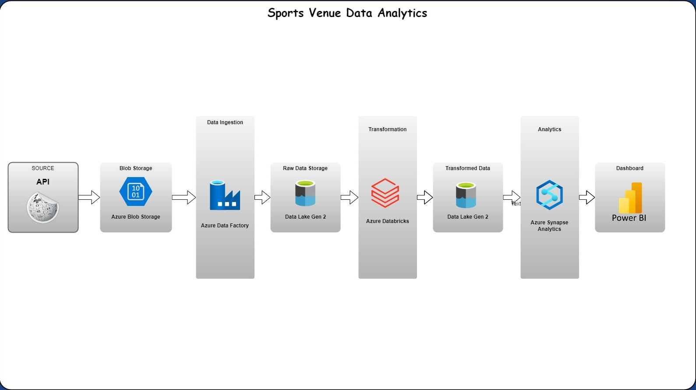
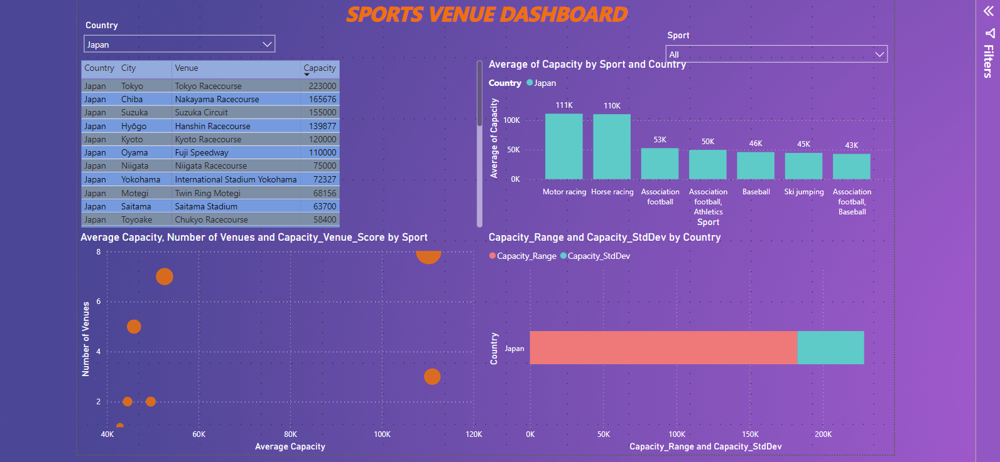

# Sports Venue Data Analysis

## Project Overview
This project provides an in-depth analysis of sports venue capacities worldwide, leveraging a variety of Azure services for data engineering tasks. By scraping data from Wikipedia, storing and transforming it using Azure technologies, and analyzing it through SQL queries, we uncover fascinating insights into the world of sports infrastructures, such as the popularity of sports in different countries, investment in sports facilities, and the diversity of venue sizes.

## Technologies Used
- **BeautifulSoup** for web scraping.
- **Azure Blob Storage** for raw data storage.
- **Azure Data Lake Storage Gen2** for hierarchical data storage.
- **Azure Data Factory** for data movement and orchestration.
- **Azure Databricks** for data transformation.
- **Azure Synapse Analytics** for exploratory data analysis (EDA).
- **Power BI** for data visualization.

### Data Source
The data was extracted from the Wikipedia page "List of sports venues by capacity". It's publicly available and can be accessed here[Wikipedia](https://en.wikipedia.org/wiki/List_of_sports_venues_by_capacity)

### Raw Data Storage
Store the scraped data into Azure Blob Storage in a container named `raw-data`. This step ensures the preservation of the original data for auditing and re-processing purposes.

### Data Movement
Utilize Azure Data Factory to transfer the raw data to Azure Data Lake Storage Gen2, maintaining a clear distinction between untouched raw data and data ready for processing.

### Data Transformation
Perform data transformation using Azure Databricks and Spark, including filtering out duplicates, cleaning data, and preparing it for analysis.

### Data Analysis
Conduct exploratory data analysis (EDA) using SQL in Azure Synapse Analytics. The analysis focuses on:
- Ranking venues by capacity.
- Average capacity by sport and country.
- The relationship between venue capacity and the number of venues.
- Diversity of sports venue sizes.

### Visualization
Visualize the insights using Power BI to create interactive dashboards that include:
- A table of sports venues by capacity.
- Bar charts of average venue capacity by sport and country.
- Scatter plots showing the relationship between the number of venues and their capacities.
- Bar charts displaying the capacity range and standard deviation of venue sizes.

- 

## Key Insights and Findings
- Football stadiums and motor racing circuits tend to have the largest capacities.
- The United States shows significant investment in sports infrastructure, especially for American football.
- There's a notable variation in venue capacities for different sports within the same country, suggesting that some sports attract larger audiences and require bigger venues.
- The "Capacity_Venue_Score" highlights countries and sports with significant investments in sports infrastructure.

## Getting Started
To replicate this project, clone this repository and follow the steps outlined above. Ensure you have access to the Azure services mentioned and configure them according to your organizational logic. For detailed instructions on each step, refer to the respective sections of this README.

